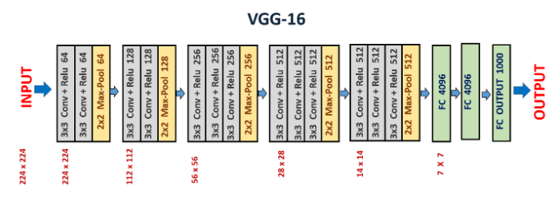

# VGG16 Net
An implementation of the VGG16 neural network architecture, one of the models described in the [paper]().

The architecture consists of five blocks, the first two with 2 convolution layers and a max pooling layer for downsampling, the remaining three blocks have 3 convolution layers followed by a max pooling layer that downsamples th feature map.

The five blocks are followe by two fully connected layers with 4096 units and the final layer with 1000 units, which is activated with a softmax activation function to obtain the output probability distribution.
